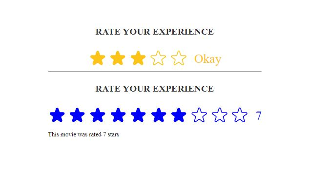

---

# Star Rating Component

A customizable star rating component built with React that allows users to rate their experience visually. The component displays a series of stars, enabling users to select a rating from a defined range.

## Features

- **Customizable Rating:** Set the maximum rating, default rating, star color, and size.
- **User Feedback:** Display contextual messages based on the selected rating.
- **Interactive UI:** Provides visual feedback on hover and selection.

## Installation

To use this component in your project, simply copy the `StarRating` component and its dependencies into your React application.

## Usage

```jsx
import StarRating from './StarRating';

function App() {
  const handleSetRating = (rating) => {
    console.log('Selected Rating:', rating);
  };

  return (
    <div>
      <StarRating
        maxRating={5}
        color="#fcc419"
        size={48}
        defaultRating={0}
        onSetRating={handleSetRating}
        messages={['Very Bad', 'Bad', 'Okay', 'Good', 'Excellent']}
      />
    </div>
  );
}
```

### Props

- **`maxRating`**: Number of stars to display (default: `5`).
- **`color`**: Color of the stars (default: `"#fcc419"`).
- **`size`**: Size of each star in pixels (default: `48`).
- **`className`**: Custom CSS class for additional styling.
- **`messages`**: Array of messages corresponding to each star rating (optional).
- **`defaultRating`**: Initial rating value (default: `0`).
- **`onSetRating`**: Callback function invoked when a rating is set.

## Styles

The component uses inline styles for layout and design. You can customize it further by adding your CSS classes.

## License

This project is licensed under the MIT License.

---

## Star Rating

